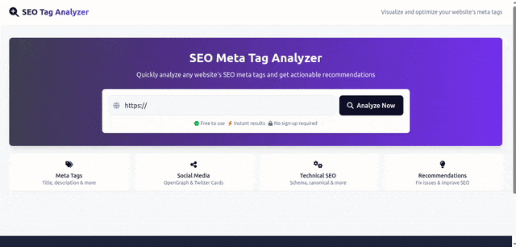

# SEO Tag Analyzer

The SEO Tag Analyzer is a web application designed to help users evaluate and optimize the SEO tags of their websites. By simply entering a website URL, the application will analyze the site's meta tags, title tags, and other relevant SEO elements. It then provides a detailed report and actionable recommendations to improve the website's search engine visibility.

## Demo

Here is a demo of the project:



## Table of Contents

- [SEO Tag Analyzer](#seo-tag-analyzer)
  - [Demo](#demo)
  - [Table of Contents](#table-of-contents)
  - [Features](#features)
  - [Getting Started](#getting-started)
    - [Prerequisites](#prerequisites)
    - [Installation](#installation)
    - [Running the Application](#running-the-application)
  - [Usage](#usage)
  - [Technologies Used](#technologies-used)
  - [Contributing](#contributing)

## Features

*   **Website Analysis:** Analyze the SEO tags of any website by entering its URL.
*   **Detailed Report:** Generate a comprehensive report of the website's SEO tag usage.
*   **Recommendations:** Provide actionable recommendations for improving SEO tag implementation.
*   **User-Friendly Interface:** Intuitive and easy-to-use interface for a seamless user experience.
*   **Real-time Analysis:** Analyze the website and display the results in real-time.
*   **Modern UI:** Built with modern UI components for a great user experience.

## Getting Started

Follow these instructions to get a copy of the project up and running on your local machine.

### Prerequisites

*   Node.js (v16 or higher)
*   npm (v7 or higher) or yarn
*   Git

### Installation

1.  Clone the repository:
    ```bash
    git clone git@github.com:RoystonDAlmeida/seo-tag-analyzer.git
    ```

2.  Navigate to the project directory:
    ```bash
    cd seo_tag_analyzer/
    ```
3.  Install dependencies:
    ```bash
    npm install
    ```
    or
    ```bash
    yarn install
    ```

### Running the Application

1.  Start the development server:
    ```bash
    npm run dev
    ```
    or
    ```bash
    yarn dev
    ```
2.  Open your web browser and go to `http://localhost:5000` (or the port specified in the terminal).

## Usage

1.  Enter the URL of the website you want to analyze in the input field.
2.  Click the "Analyze" button.
3.  The application will fetch the website's data and display the SEO tag analysis report.
4.  Review the report and follow the recommendations to improve the website's SEO.

## Technologies Used

*   **React:** A JavaScript library for building user interfaces.
*   **TypeScript:** A statically typed superset of JavaScript.
*   **Wouter:** A minimal routing library for React.
*   **React Query:** For fetching, caching, synchronizing, and updating server state.
*   **Tailwind CSS:** For UI components.
*   **npm/yarn:** Package manager for JavaScript.
*   **Vite:** Build tool and development server.

## Contributing

Contributions are welcome! If you'd like to contribute to the project, please follow these steps:

1.  Fork the repository.
2.  Create a new branch for your feature or bug fix.
3.  Make your changes and commit them.
4.  Push your changes to your forked repository.
5.  Submit a pull request to the main repository.